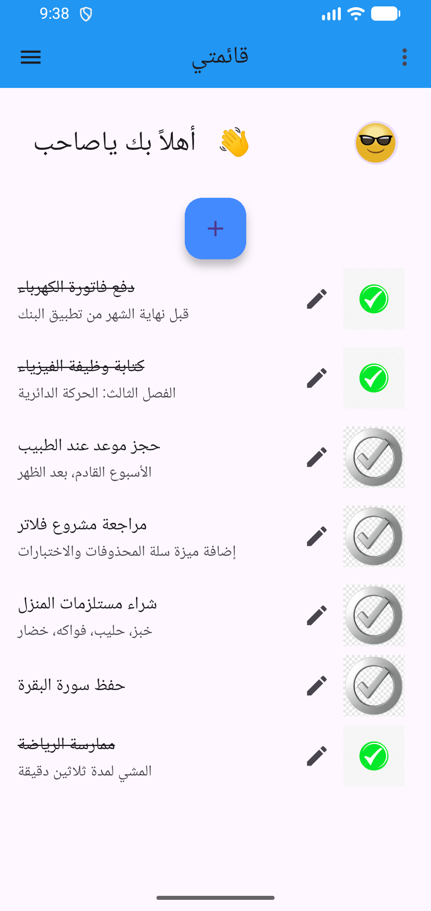
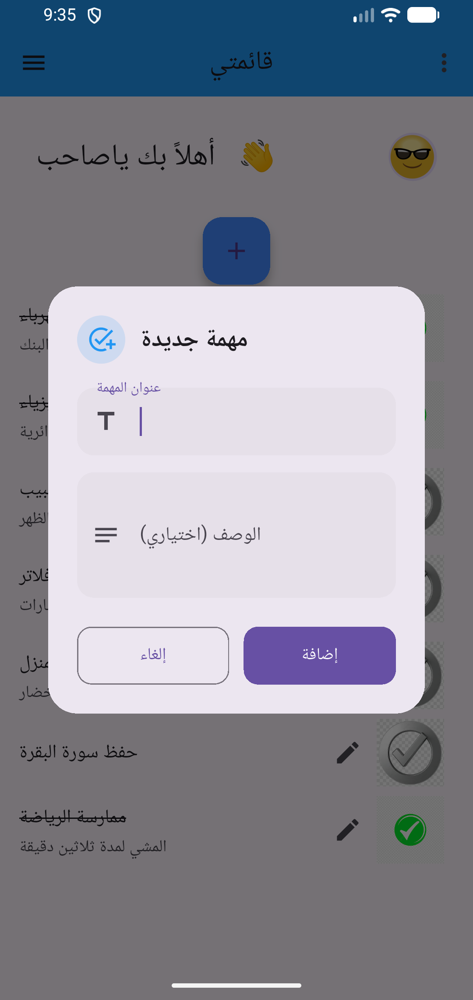
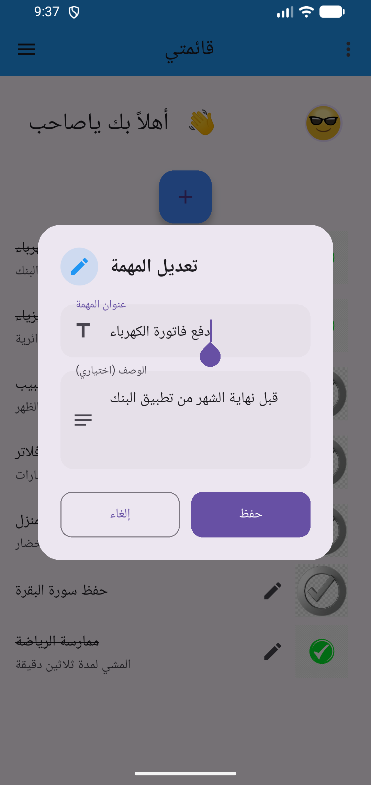
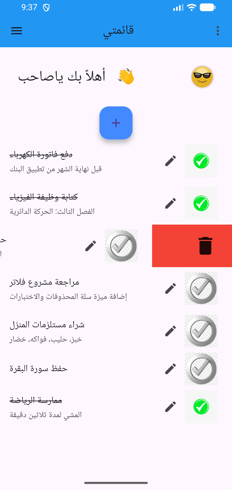
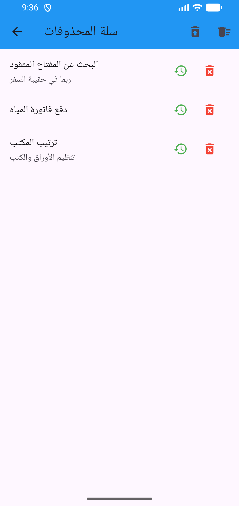
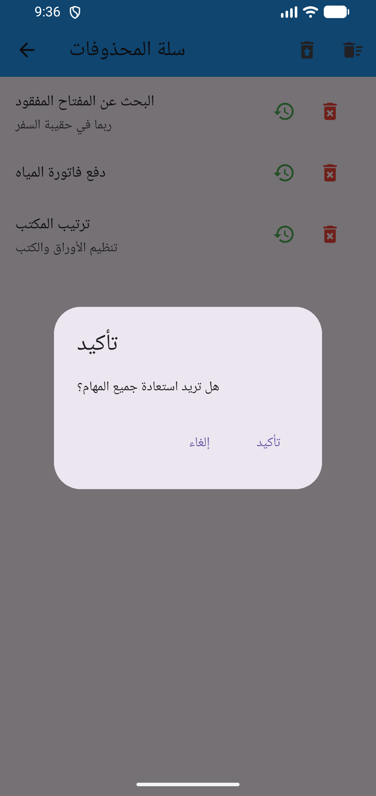
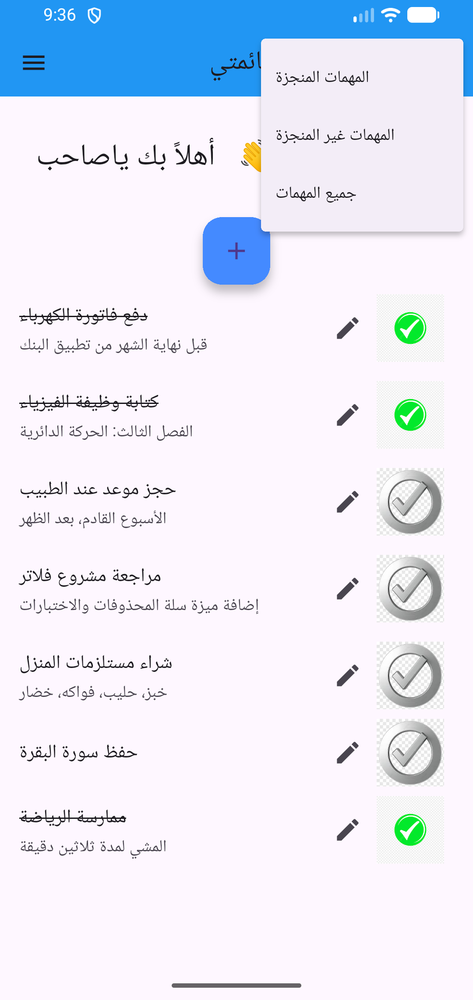
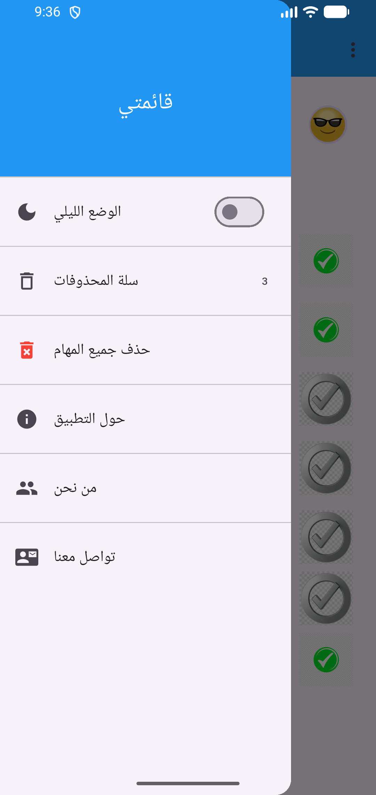
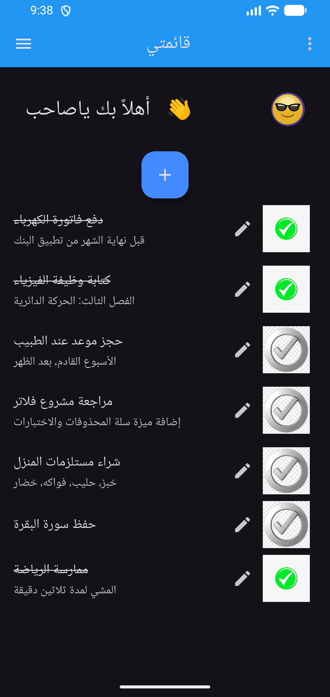

# Todo List App

A simple, clean task manager built with Flutter. Add tasks with descriptions, edit them, filter by status, and recover anything you delete from the built-in trash. Everything is stored locally on the device, so it works offline.

The interface is in Arabic (right-to-left).

## Screenshots

<p align="center">
  
  
  
  
</p>

<p align="center">
  
  
  
  
</p>

<p align="center">
  
</p>

## Features

- **Add tasks** with a title and an optional description
- **Edit tasks** at any time from the pencil icon next to each task
- **Mark as done** by tapping a task
- **Swipe to delete**, with an undo action in the snackbar
- **Trash bin**
  - Restore a single task or delete it permanently
  - Restore all tasks at once
  - Empty the trash (both bulk actions ask for confirmation)
- **Filter** the list: all, completed, or not completed
- **Dark mode**, remembered between launches
- **Local persistence** with `shared_preferences` for tasks, trash, and theme

## Tech Stack

- [Flutter](https://flutter.dev) / Dart
- [provider](https://pub.dev/packages/provider) for state management
- [shared_preferences](https://pub.dev/packages/shared_preferences) for local storage

## Project Structure

```
lib/
├── main.dart                    # App entry point and theme setup
├── home_page.dart               # Main screen (app bar, filter menu)
├── models/
│   └── task.dart                # Task model with JSON serialization
├── providers/
│   └── task_providers.dart      # State: tasks, trash, filter, theme, storage
└── Screens/
    ├── trash_page.dart          # Trash bin screen
    └── components/
        ├── app_drawer.dart      # Side drawer (theme, trash, about, contact)
        ├── body.dart
        ├── add_task_button.dart
        ├── task.form.dart       # Add / edit task dialog
        ├── task_list.dart       # Task list with swipe-to-delete
        └── welcome.dart
```

## Getting Started

Prerequisites: [Flutter SDK](https://docs.flutter.dev/get-started/install) (Dart `^3.11.1`).

```bash
git clone https://github.com/huzaifakhashan/TodoList-app.git
cd TodoList-app
flutter pub get
flutter run
```

Run the tests:

```bash
flutter test
```

## Download

Prebuilt APKs are available on the [Releases page](https://github.com/huzaifakhashan/TodoList-app/releases).

## Author

**Huzaifa Khashan**  
GitHub: [@huzaifakhashan](https://github.com/huzaifakhashan)
