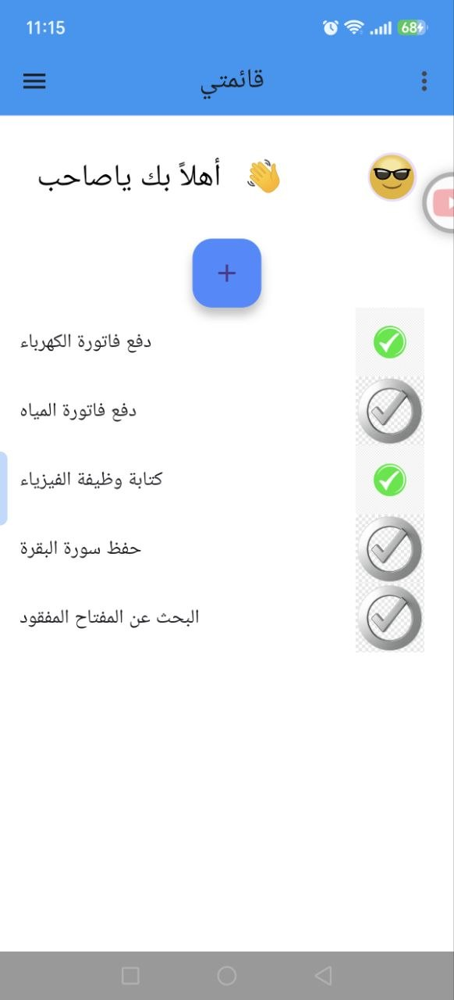
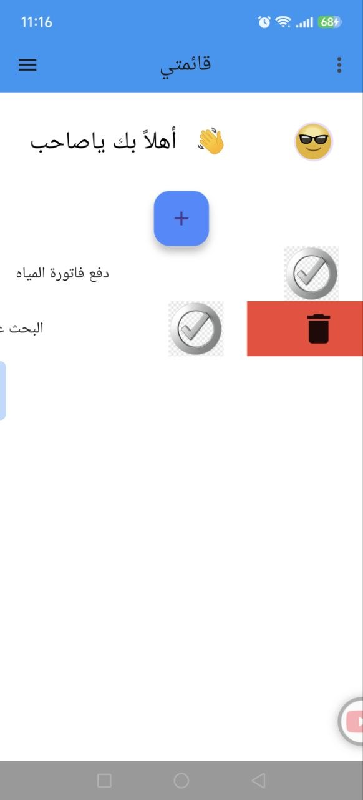
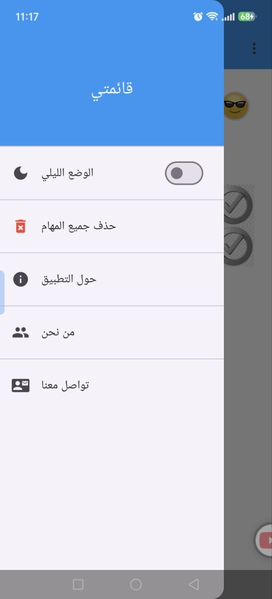
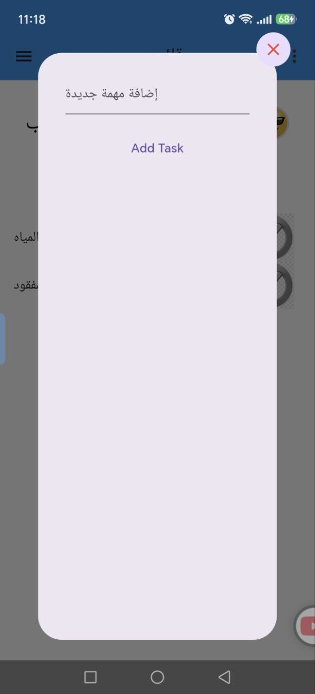
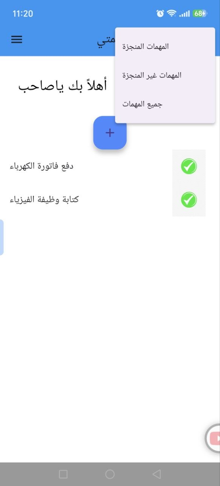

# Todo List App 📝

A simple and easy-to-use Todo List application built with Flutter.

## 📱 Features

- Add new tasks
- Delete tasks
- Mark tasks as completed
- Simple and clean user interface
- Easy task management

## 🛠️ Built With

- Flutter
- Dart

## 📸 Screenshots

<p align="center">
  
  
  
</p>

<p align="center">
  
  
</p>


## 🚀 Getting Started

To run this project:

```bash
flutter pub get
flutter run


## 📥 Download

Download the latest version of the application:

[⬇️ Download APK](https://github.com/huzaifakhashan/TodoList-app/releases/tag/v1.0.0)
